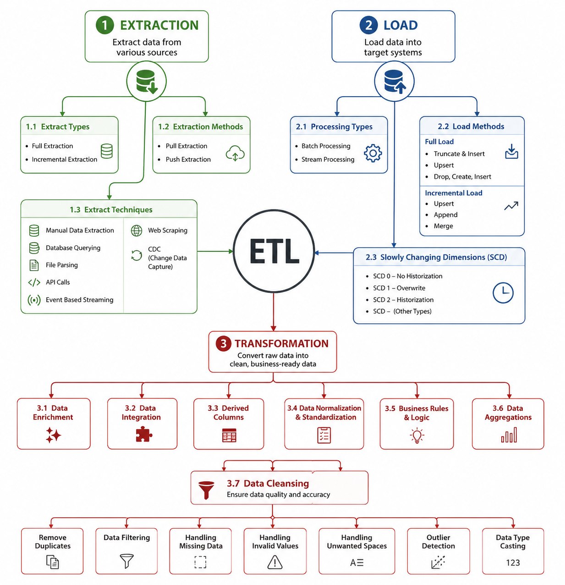
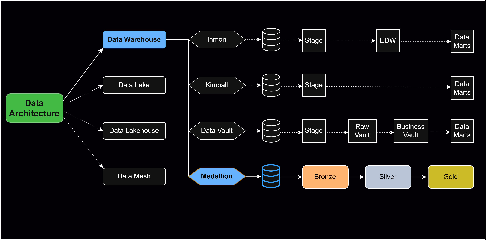
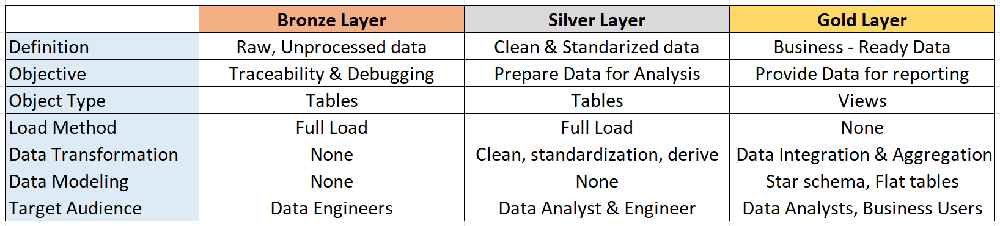
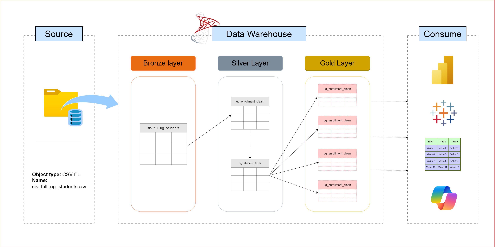

# SQL Data Warehouse

Building a modern data warehouse using SQL Server, ETL processes, and data modeling.

---

## 🏗️ Data Engineering: Building the Data Warehouse

**Objective**  

Develop a modern data warehouse using SQL Server to consolidate SIS data, enabling analytical reporting and providing automated, ready-to-use metrics.

### Specifications:

1. **Data Sources**  
   Import data from source systems (Oracle), provided as CSV files.

2. **Data Quality**  
   Cleanse and resolve data quality issues before analysis.

3. **Data Integration**  
   Combine data sources into a unified, user-friendly data model optimized for analytical queries.

4. **Documentation**  
   Provide clear documentation of the data model to support both business stakeholders and analytics teams.

---

## 📊 BI: Analytics & Reporting (Data Analysis)

**Objective**

Develop SQL-based analytics to deliver detailed reports on:

- Student distribution  
- Full-Time Equivalent (FTE) students  
- Cohort tracking  

These insights empower stakeholders with key business metrics and support strategic decision-making.

### 🔄 ETL Technique

The ETL (Extract, Transform, Load) process is designed to ensure reliable and high-quality data integration:

``

### Data Architecture (Structure Approach)

### 🥉🥈 Data Warehouse Layers

- **Bronze:** Raw data (no transformation)  
- **Silver:** Cleaned and standardized data  
- **Gold:** Aggregated data for reporting (star schema)

### 🔄 Data Flow

End-to-end flow from source systems to analytics consumption.
